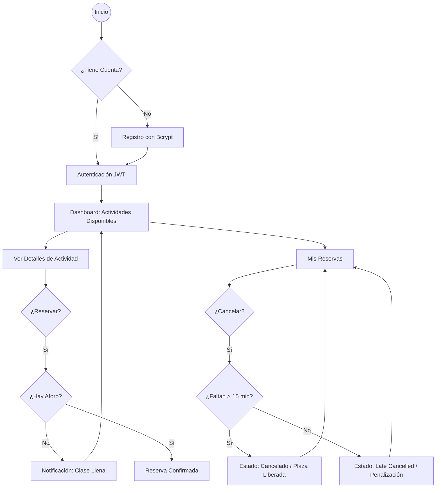
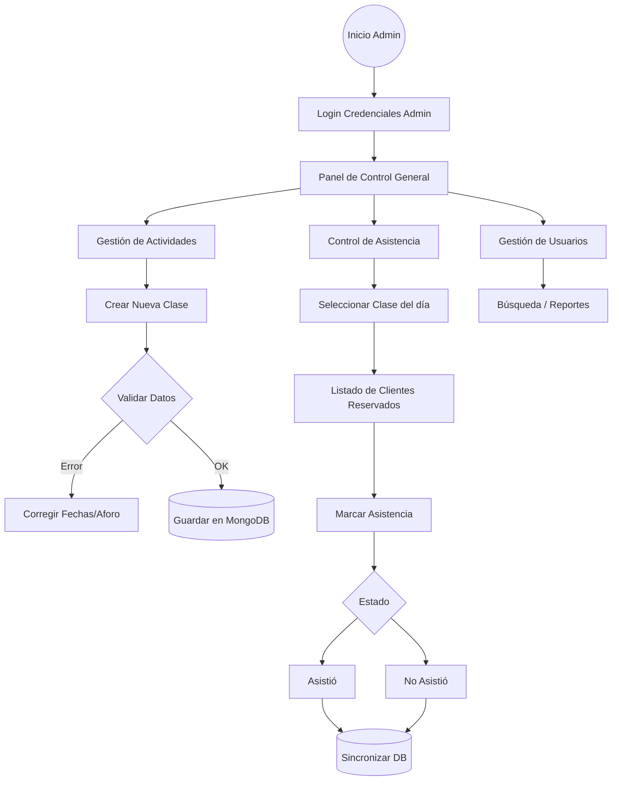

# Gym Manager - Plataforma Centralizada de Actividades

Proyecto Final para 2º de DAM (Desarrollo de Aplicaciones Multiplataforma). Un sistema integral para la gestión de clases deportivas, con backend unificado, panel de administración de escritorio y aplicación móvil para clientes.

## 1. Visión General
Gym Manager permite a los administradores gestionar el calendario de clases, controlar el aforo en tiempo real y pasar lista de asistencia. Los clientes pueden registrarse, consultar actividades disponibles y gestionar sus reservas bajo reglas estrictas de negocio.

## 2. Stack Tecnológico
- **Backend:** Python 3.10+ con **FastAPI** (Asíncrono).
- **Base de Datos:** **MongoDB Atlas** (Cloud NoSQL).
- **Desktop:** **Vue.js 3** + **Vite** + **Electron** + **Tailwind CSS**.
- **Mobile:** **Flutter** (Material Design 3).
- **Seguridad:** **Bcrypt** (Hashing) y **JWT** (Sesiones).

---

## 3. Diagramas de Flujo de Uso

### A. Aplicación Móvil (Flujo del Cliente)
Este diagrama describe la experiencia del usuario desde el registro hasta la gestión de reservas, incluyendo la lógica de cancelación.



### B. Aplicación de Escritorio (Flujo del Administrador)
Describe las tareas de gestión de clases y control de asistencia que realiza el personal del gimnasio.



---

## 4. Modelado de Datos con Pydantic
Se ha utilizado **Pydantic** para garantizar la integridad de los datos en toda la aplicación.

- **Validación Estricta:** Los modelos aseguran que las fechas de fin sean posteriores a las de inicio, los emails sean válidos y los aforos sean números positivos.
- **Separación de Esquemas:** Se distinguen modelos de `Create` (donde se recibe la password) y `Response` (donde se filtra información sensible y se mapea el `_id` de MongoDB a `id`).

### Ejemplo de Modelo (Actividades):
```python
class ActivityBase(BaseModel):
    title: str
    start_time: datetime
    end_time: datetime
    capacity: int = Field(gt=0)

    @field_validator('end_time')
    def end_time_must_be_after_start_time(cls, v, values):
        # Lógica de validación cruzada
```

---

## 4. Seguridad: Hashing con Bcrypt
La seguridad es el pilar del sistema. Nunca se almacenan contraseñas en texto plano.

- **Hashing:** Al registrar un usuario, se genera un "salt" automático y se hashea la contraseña usando el algoritmo **Bcrypt** mediante la librería `passlib`.
- **Verificación:** Durante el login, se compara el hash almacenado con la contraseña ingresada de forma segura (protección contra ataques de tiempo).
- **JWT (JSON Web Tokens):** Una vez autenticado, el usuario recibe un token firmado que expira en 24 horas y contiene su identidad y **Rol (Admin/Client)**.

---

## 5. Reglas de Negocio Críticas

### A. Prevención de Duplicados
Se ha implementado un **Índice Único Compuesto Parcial** en MongoDB sobre la colección de reservas:
- **Regla:** Un usuario no puede tener dos reservas activas para la misma actividad.
- **Implementación:** `uniqueIndex(user_id, activity_id)` donde `status == 'active'`.

### B. Regla de los 15 Minutos (Cancelación)
El sistema gestiona de forma inteligente las cancelaciones según la proximidad del evento:
- **Cancelación Temprana (> 15 min):** Se marca como `cancelled`, la plaza se libera y el aforo de la clase disminuye.
- **Cancelación Tardía (< 15 min):** Se marca como `late_cancelled`. El alumno pierde la plaza, pero esta **no se libera** para otros (penalización), y cuenta como no asistencia.

---

## 6. Guía de Inicio Rápido

### Requisitos Previos
- Python 3.10+
- Node.js 18+
- Flutter SDK

### 1. Servidor Backend
```bash
cd backend
python3 -m venv venv
.\venv\Scripts\activate
pip install -r requirements.txt
# Configura tu .env con la MONGODB_URL
uvicorn main:app --reload --port 8000
```

### 2. App Escritorio (Admin)
```bash
cd desktop
npm install
# Configura VITE_API_URL en .env (por defecto http://127.0.0.1:8000)
npm run electron:dev
```

### 3. App Móvil (Flutter)
**Nota importante:** Si usas un móvil físico, edita `mobile/lib/config.dart` para poner la IP de tu ordenador en lugar de `localhost`.

```bash
cd mobile
flutter pub get
flutter run -d chrome  # o tu emulador preferido
```


---

## 7. Credenciales de Prueba
| Rol | Email | Password |
| :--- | :--- | :--- |
| **Administrador** | `admin_rafael@test.com` | `adminpass` |
| **Cliente** | `ana.garcia@gmail.com` | `pass` |

---

## 8. Estructura del Repositorio
- `/backend`: API REST, lógica de DB y modelos.
- `/desktop`: Aplicación Vue + Electron para gestión.
- `/mobile`: Aplicación Flutter para clientes y control de acceso.
- `.env`: Configuración de entorno compartida.
